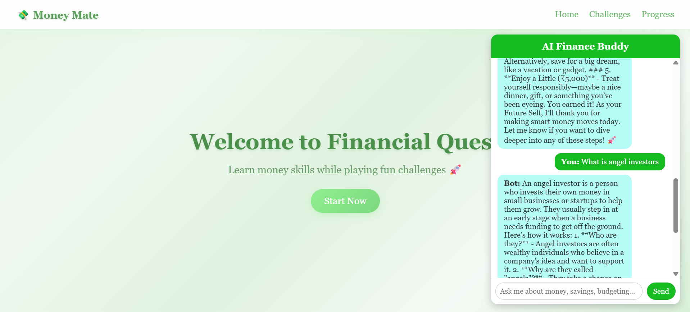
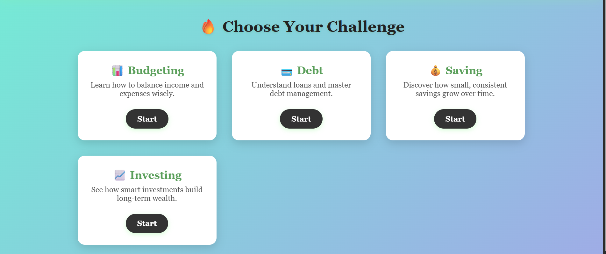
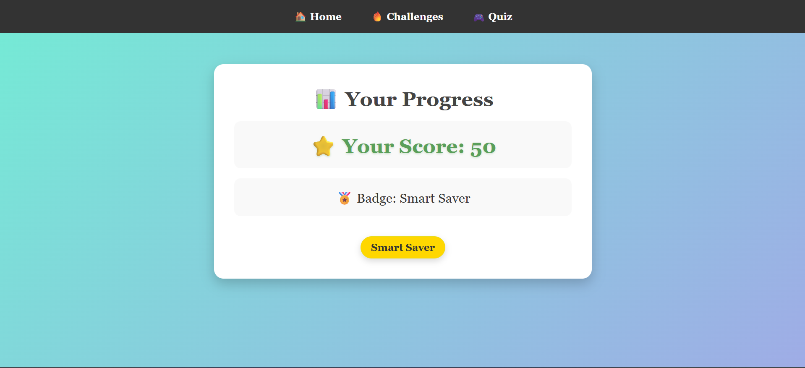

# 💰 MoneyMate – Gamified Financial Literacy Web App

<p align="center">
  
  
  
  
</p>

---

## 🧩 Problem Statement
Many young adults enter adulthood **without financial literacy skills**, leading to poor decisions in:
- 💳 Credit & debt management  
- 🏦 Saving habits  
- 📊 Budgeting & planning  

---

## 💡 Our Solution – *MoneyMate*
An **interactive web application** that teaches financial concepts through **gamified quizzes** and **scenario-based learning**.

🎮 **How it works**:
- Answer **real-world financial scenarios**
- Earn **points & badges**
- Track your **progress dashboard**
- Learn by doing, not just reading

---

## ✨ Features
- ✅ **Gamified quizzes** (Budgeting, Saving, Debt, Investment)  
- 🏅 **Badge unlock system** – *Budget Beginner, Smart Saver*  
- 📊 **Progress tracking** (score + badges saved via LocalStorage)  
- 🎨 **Simple, responsive design** (works in any browser)  

---

## 🖼️ Screenshots
> *(Replace placeholder images with real screenshots later)*  

| 🏠 Home Page | 🎮 Quiz Page | 📊 Progress Page |
|--------------|-------------|------------------|
|  |  |  |


---

## 👩‍👩‍👧‍👦 Team Members & Roles
- **Janaki R** – UI & Navigation (Landing, Challenges, Progress pages)  
- **Sreya Maxwel** – Quiz Logic & Score Tracking (JavaScript)  
- **Shadha Shareef** – Financial Scenarios & Content Creation  
- **Saniya Jose** – Styling (CSS) & Final Integration  

---

## 🚀 Quick Start
Clone and run locally:
```bash
git clone https://github.com/SreyaMaxwel/BitnBuild
cd money-mate
